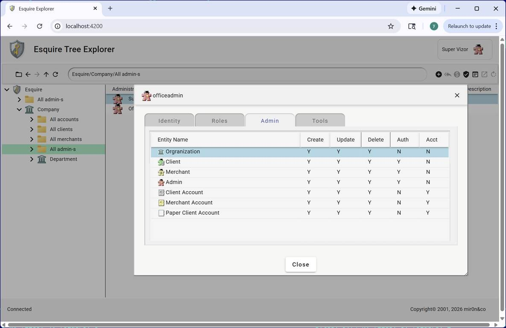

|  | Esquire Frameworks(tm) 2.0 |
|----------------------------|-------------------------|

Frameworks for organizing business entities in a tree, for any business or activity. The framework is targeting to cover traditional functionality for a Backoffice (sub)system: onboarding, user profile maintenance, permissions, authorization, and accounting.

## 

## esquire.explorer: Esquire Tree Explorer

Part of Esquire frameworks. The frontend component, a user interface that allows users to navigate through the entity tree, manage the state of entities, modify relationships between entities, and perform administrative operations and procedures.

## Esquire Explorer Error Report

## Access Profile

## 

## v1.2.2 — complete (04/20/2026)

The core UI layer is delivered as a standalone library (`@mir0n-pro/esquire.ui`) that the explorer
frontend consumes as a package dependency. The library provides the tree explorer component
(`EsqExplorerComponent`), server-driven details dialogs (`EsqEntityDetailsDialog`,
`EsqNodeDetailsDialog`), entity select/move/confirm dialogs, dictionary-driven field rendering
(`EsqTabFieldComponent` covering all field types), permission model (`EsqAccessProfile`), kind
registry (`EsqObjectKindFactory`), and pluggable command handler infrastructure
(`EsqCommandHandlerRegistry`). Field layouts, control types, and validation rules are delivered at
runtime from server configuration — no field definitions are hardcoded in the frontend.

On top of the library, the explorer frontend delivers the full entity lifecycle (Create, Move, Delete
with tree refresh and permission gating) and a complete accounting command set: Deposit, Withdrawal,
and Transfer dialogs with dictionary-driven fields, AmountEffect validation, account picker
(`EsqAcctPicker`), and dynamic cross-currency rate label. The REST API was generalized to
kind-uniform endpoints, and the `esquire.ui` source tree was removed from the frontend and replaced
by the published package. The release is covered by a 30-test Playwright e2e suite validating full
entity and accounting lifecycles.

